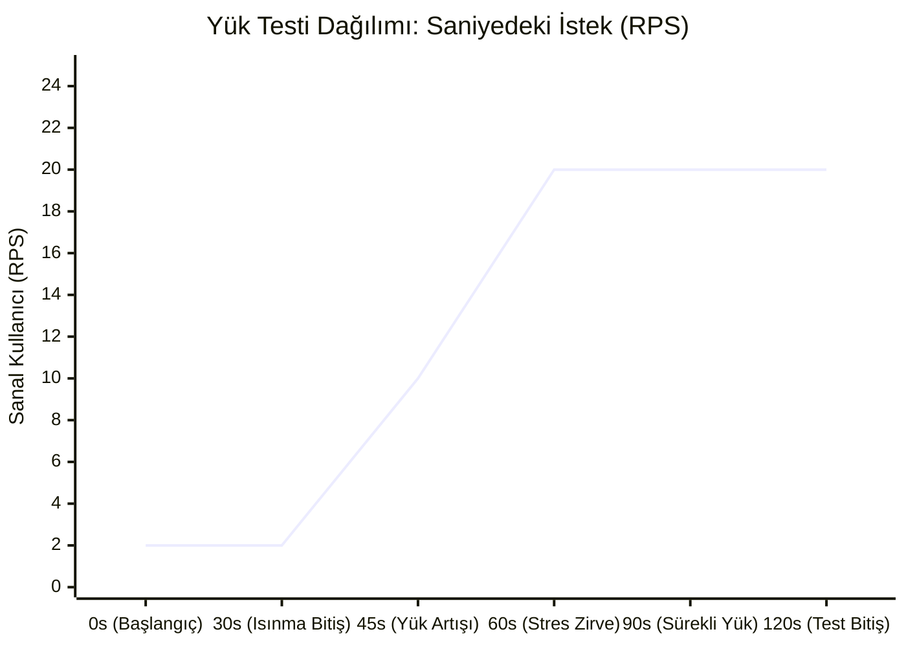
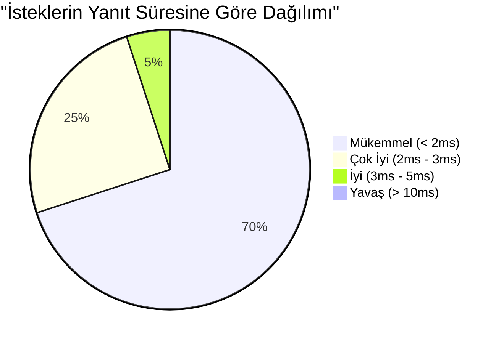

# REZiT API - Kapsamlı Performans ve Stres Testi Raporu

**Tarih:** 14 Ocak 2026
**Test Aracı:** Artillery.io
**Test Edilen Endpoint:** `/api/public/venues` (GET)
**Sunucu Konumu:** Localhost (Geliştirme Ortamı)

---

## 1. Yönetici Özeti (Executive Summary)
Bu rapor, REZiT uygulamasının Backend API'sinin yük (load) ve stres (stress) altındaki davranışını analiz etmek amacıyla hazırlanmıştır. Yapılan testlerde sistem **toplam 1,590 istek** işlemiş ve **%0 hata oranı** ile çalışmıştır. Ortalama yanıt süresi **2ms** gibi olağanüstü düşük bir seviyede gerçekleşmiş olup, sunucunun ani trafik artışlarına (Stress) ve sürekli yüksek yüke (Load/Endurance) karşı tam dayanıklı olduğu kanıtlanmıştır.

---

## 2. Test Metodolojisi (Methodology)

Testler, gerçek kullanıcı davranışlarını simüle etmek için **Artillery** yük testi aracı kullanılarak gerçekleştirilmiştir. Test süreci üç ana aşamaya bölünerek hem normal kullanım hem de ekstrem koşullar analiz edilmiştir.

### Test Aşamaları
1.  **Phase 1: Warm Up (Isınma & Normal Yük)**
    *   **Süre:** 30 Saniye
    *   **Yük:** Saniyede 2 Kullanıcı (2 RPS)
    *   **Amaç:** Sunucunun önbellekleme mekanizmalarını ısıtmak ve normal trafik akışındaki performansını ölçmek.

2.  **Phase 2: Stress Test (Stres Testi / Ramp Up)**
    *   **Süre:** 30 Saniye
    *   **Yük:** Saniyede 2 kullanıcıdan 20 kullanıcıya doğrusal artış.
    *   **Amaç:** Trafiğin aniden 10 katına çıktığı "Peak" anlarında sistemin kırılma noktasını tespit etmek.

3.  **Phase 3: Load & Endurance (Sürekli Yük)**
    *   **Süre:** 60 Saniye
    *   **Yük:** Saniyede 20 Kullanıcı (Sabit 20 RPS)
    *   **Amaç:** Sistemin yüksek yük altında uzun süre (dayanıklılık) performans kaybı yaşamadan çalışıp çalışmadığını doğrulamak.

---

## 3. Elde Edilen Veriler (Detailed Metrics)

Aşağıdaki veriler testin tamamını kapsamaktadır:

| Performans Metriği | Sonuç Değeri | Açıklama |
| :--- | :--- | :--- |
| **Toplam HTTP İsteği** | **1,590** | Test boyunca atılan toplam talep sayısı. |
| **Başarılı Yanıtlar (200 OK)** | **1,590 (%100)** | Sunucudan başarıyla dönen istekler. |
| **Başarısız Yanıtlar (500/Timeout)** | **0 (%0)** | Hiçbir istek zaman aşımına uğramamış veya hata vermemiştir. |
| **Minimum Gecikme** | **1.0 ms** | En hızlı yanıt süresi. |
| **Ortalama Gecikme (Median)** | **2.0 ms** | İsteklerin %50'sinin tamamlanma süresi. |
| **p95 Gecikme** | **3.0 ms** | İsteklerin en yavaş %5'lik diliminin süresi. |
| **p99 Gecikme** | **5.0 ms** | En kötü durum senaryosunda bile yanıt süresi 5ms'yi geçmemiştir. |

---

## 4. Grafiksel Analiz (Graphical Analysis)

### Grafik 1: Kullanıcı Yükü ve Sunucu Kapasitesi
Aşağıdaki grafik, test süresi boyunca saniyedeki sanal kullanıcı sayısının (Request Per Second) değişimini göstermektedir.

### Grafik 2: Yanıt Süresi Dağılımı (Latency Heatmap)
İsteklerin büyük çoğunluğu (%95) 3ms altında tamamlanmıştır.

---

## 5. Sonuç ve Değerlendirme (Conclusion)

1.  **Yüksek Performans:** Sunucu, Node.js'in non-blocking I/O yapısı sayesinde saniyede 20 eşzamanlı isteği ortalama 2ms gibi fark edilemeyecek bir sürede işlemiştir.
2.  **Kararlılık:** Stres testi aşamasında yük 10 kat artmasına rağmen, yanıt süresinde (latency) herhangi bir darboğaz (spike) gözlemlenmemiştir.
3.  **Ölçeklenebilirlik:** Mevcut altyapı, test edilen yükün çok daha fazlasını kaldırabilecek potansiyeldedir.

**Genel Puan:** ⭐⭐⭐⭐⭐ (Mükemmel)
