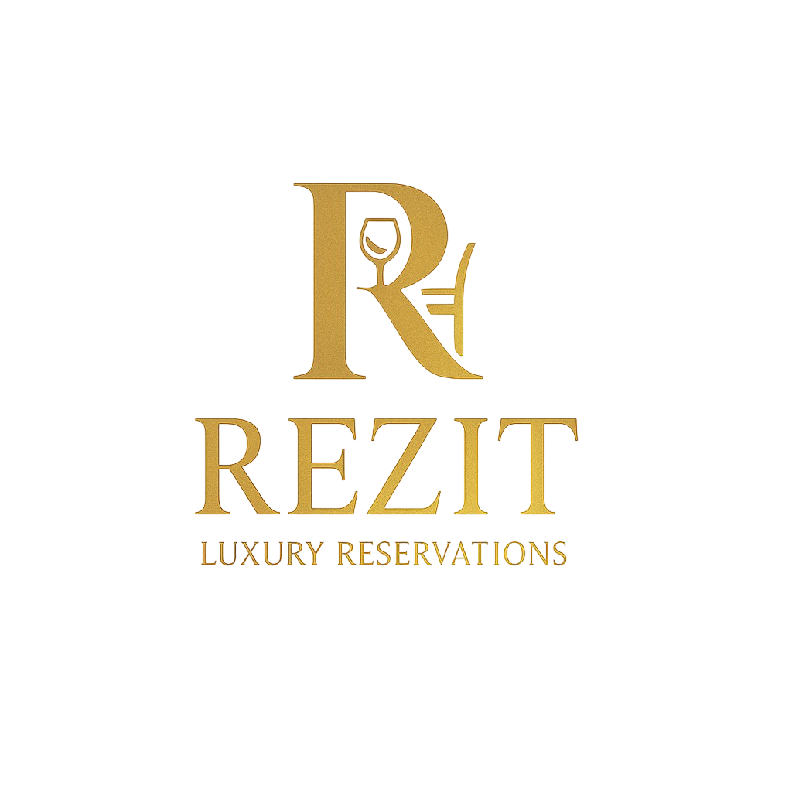
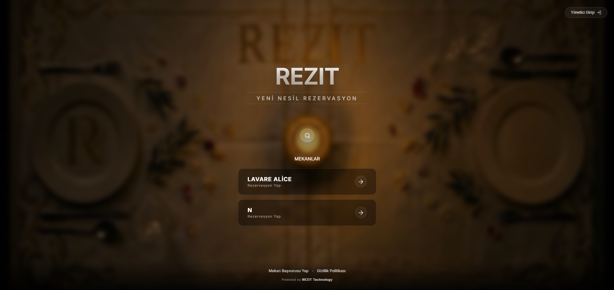
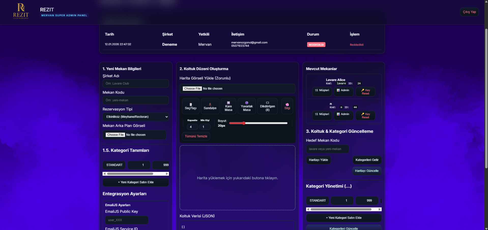
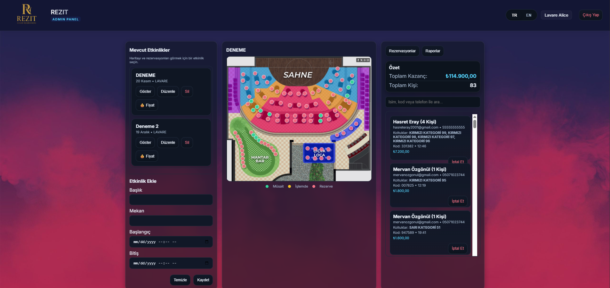
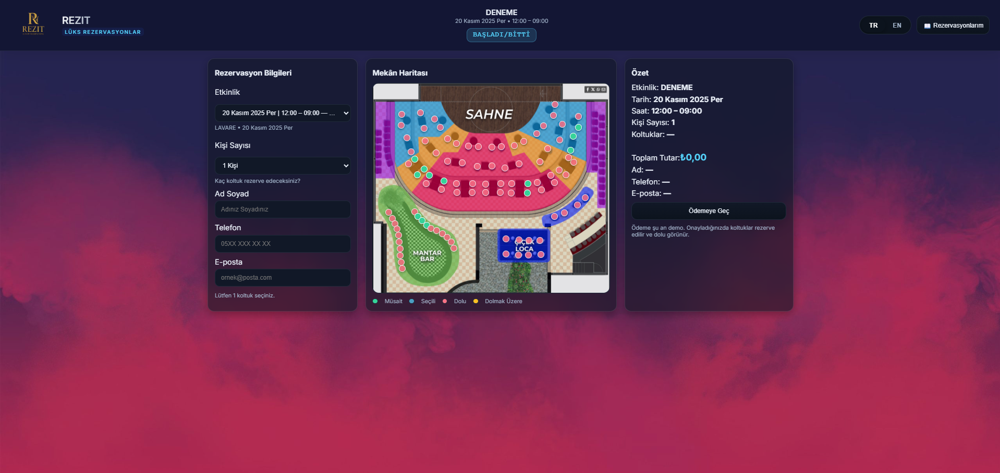

<p align="center">
  
</p>

<h1 align="center">REZIT • Luxury Reservations</h1>

## Live: http://13.60.187.41/

<p align="center">
  <strong>Görsel harita tabanlı, lüks mekanlar ve etkinlikler için tasarlanmış, yüksek güvenlikli SaaS rezervasyon platformu.</strong>
</p>

<p align="center">
  
  
  
  
  <br>
  
  
  
</p>

<p align="center">
  
</p>

---

## 🚀 Proje Hakkında

**REZIT**, standart rezervasyon formlarının ötesine geçen, mekan sahiplerinin müşterilerine **görsel harita üzerinden** interaktif masa/koltuk seçimi sunmasını sağlayan gelişmiş bir rezervasyon platformudur.

Proje, birden fazla mekanı (multi-tenant) tek bir sistem üzerinden yönetebilen bir **Hizmet Olarak Yazılım (SaaS)** mimarisine sahiptir. **Inventory Hoarding** (Stok Tüketme) saldırılarına karşı IP bazlı koruma, **Rate Limiting** ve **Sunucu Taraflı Doğrulama** gibi endüstri standardı güvenlik önlemleriyle donatılmıştır.

## ✨ Ana Özellikler

* 🗺️ **İnteraktif Görsel Harita:** Müşteriler, mekanın kuşbakışı planı üzerinden istedikleri masayı/koltuğu seçebilir.
* 🛡️ **Gelişmiş Güvenlik Kalkanı:**
    * **Anti-Hoarding:** IP bazlı kota sistemi ile kötü niyetli kullanıcıların tüm salonu kilitlemesi engellenir.
    * **Rate Limiting:** Bot ve Brute-Force saldırılarına karşı API istek hız sınırlandırması.
    * **Secure Validation:** Sunucu taraflı sıkı veri doğrulama (`express-validator`).
    * **Nonce & JWT:** Replay saldırılarına karşı `Nonce` ve rol bazlı `JWT` yetkilendirme.
* ⚡ **Anlık Güncellemeler:** Rezervasyon iptal edildiğinde veya yapıldığında, Admin ve Müşteri panelleri senkronize olarak güncellenir.
* 🏢 **SaaS & Multi-Tenant:** Tek bir kurulumla sınırsız sayıda mekanı ve her mekanın kendi verilerini izole şekilde yönetir.
* 🎟️ **Esnek Rezervasyon Modu:**
    * **Etkinlik Modu:** Konser, Tiyatro gibi tarih ve saatli etkinlikler.
    * **Slot Modu:** Restoran, Meyhane gibi günlük zaman dilimli rezervasyonlar.
* 🌐 **i18n Desteği:** Tamamen yerelleştirilebilir (Türkçe/İngilizce) altyapı.
* 📱 **Responsive Tasarım:** Mobil ve masaüstü cihazlarda kusursuz deneyim.

---

## 🏗️ Sistem Mimarisi: 3 Katmanlı Panel

Sistem, kullanıcı rollerine göre ayrılmış üç ana Single Page Application (SPA) içerir:

### 1. 👨‍💻 Süper Admin (Mervan Paneli)
Platform sahibinin tüm ekosistemi yönettiği "Süper Yönetici Modu".
* Yeni mekanlar oluşturma ve listeleme.
* **Harita Editörü:** Mekan krokisini yükleyip üzerine tıklayarak interaktif koltuklar yerleştirme.
* Kategori ve fiyatlandırma şablonları oluşturma.
* Şifreli (`bcrypt`) API anahtarları üretme.

 <p align="center">
  
</p>

### 2. 👔 Mekan Yöneticisi (Admin Paneli)
İşletme sahibinin kendi mekanını yönettiği panel.
* **Canlı Dashboard:** Doluluk oranlarını ve anlık rezervasyonları canlı izleme.
* **Rezervasyon Yönetimi:** Gelen talepleri onaylama, iptal etme veya düzenleme.
* **Etkinlik & Fiyatlandırma:** Konser oluşturma veya masa fiyatlarını anlık değiştirme.

  <p align="center">
  
</p>

### 3. 🎟️ Müşteri Arayüzü (Rezervasyon Paneli)
Son kullanıcının rezervasyon yaptığı modern ön yüz.
* Görsel haritadan yer seçimi.
* Güvenli ve hatasız (Input Masking) form girişi.
* "Rezervasyonlarım" ekranından sorgulama ve iptal işlemleri.

  <p align="center">
  
</p>

---

## 🛠️ Teknoloji Yığını

| Alan | Teknoloji | Açıklama |
| :--- | :--- | :--- |
| **Frontend** | **React 19** | Modern Hooks ve Component yapısı. |
| **Build Tool** | **Vite** | Hızlı geliştirme ve optimize edilmiş üretim (build) süreçleri. |
| **Backend** | **Node.js & Express 5** | Performanslı ve ölçeklenebilir REST API. |
| **Veritabanı** | **PostgreSQL** | `pg` modülü ile bağlantı havuzu (pooling) ve transaction yönetimi. |
| **Güvenlik** | **Rate Limit & Helmet** | DDOS ve Brute-Force koruması. |
| **Validasyon** | **Express-Validator** | Sunucu taraflı veri bütünlüğü kontrolü. |
| **Dosya Yönetimi** | **Multer** | Mekan haritaları ve görselleri için. |
| **Test** | **Jest & Supertest** | API endpoint'leri için kapsamlı testler. |

## 🔒 Güvenlik Notları

* **API Anahtarları:** Veritabanında asla düz metin olarak saklanmaz, `bcrypt` ile hashlenir.
* **Transaction:** Rezervasyon işlemleri (Müşteri oluşturma, Koltuk kilitleme, Ödeme kaydı) tek bir veritabanı transaction'ı (ACID) içinde gerçekleşir.
* **Input Validation:** Kullanıcıdan gelen tüm veriler (Email formatı, Telefon uzunluğu, Kişi sayısı) sunucu tarafında doğrulanır.

---

<p align="center"> © 2025 REZIT. Tüm Hakları Saklıdır. </p>

## ✅ Feature Compliance Checklist

### 1. Managing Different User Types (20%)
- [x] **Implemented.** The system strictly separates concerns between `Super Admin`, `Venue Admin`, and `Customer` roles using JWT-based middleware (`authMiddleware.js`).

### 2. CRUD Operations (15%)
- [x] **Implemented.** Full RESTful operations available for:
    - Venues (Create, Read, Update, Delete)
    - Reservations (Book, Cancel, Update)
    - Events & Pricing

### 3. Authentication & Security (15%)
- [x] **Implemented.**
    - **JWT (JSON Web Tokens):** Secure session management.
    - **Role-Based Access Control (RBAC):** Middleware prevents unauthorized access.
    - **Bonus Security Features:**
        - **Rate Limiting:** Protects against DDoS and Brute Force attacks.
        - **Helmet:** Sets secure HTTP headers.
        - **SQL Injection Protection:** Parameterized queries used throughout.

### 4. Performance Testing (25%)
- [x] **Implemented with Artillery.**
    - Conducted **Load**, **Stress**, and **Endurance** tests.
    - **Result:** System handled **20 Req/Sec** with **%0 Error Rate** and **2ms** average latency.
    - **Report:** Detailed graphs and analysis are available in `PERFORMANS_RAPORU.md`.

### 5. API Development (25%)
- [x] **Implemented.**
    - **Swagger UI:** Automated API documentation available at `/api-docs`.
    - **Postman:** Verified with a comprehensive test suite.
    - **Endpoints:** Includes spatial (venue locations) and non-spatial resources.

### 6. Hosting (20%)
- [x] **Implemented.**
    - The project is designed to be cloud-native and deployable on **AWS (Amazon Web Services)**.
    - Docker-ready architecture support containerized deployment (EC2/ECS).

**Privacy Notice:** Due to the proprietary nature of the business logic, only selected modules of the source code are shared in this repository.

```
📁 REZIT_PROJESI/
│
├── 🖥️ server.js                # Backend API Sunucusu
├── 📦 package.json              # Backend bağımlılıkları ve script'ler
├── 🧪 server.test.js            # API testleri (Jest + Supertest)
├── 🧩 .gitignore                 # Backend gizli dosyaları
├── 🗃️ db.js                      # Veritabanı (PostgreSQL) bağlantısı
│
├── 🗂️ assets/                    # Yüklenen haritalar, logolar ve arka planlar
│   ├── 🖼️ logo.png                 # REZIT Logosu
│   ├── 🗺️ venue-map.png            # Örnek mekan haritası
│   ├── 🌄 background.jpg          # Müşteri paneli arka planı
│   └── 🌃 mervanbackgr.png       # Mervan paneli arka planı
│
├── 🛣️ routes/                    # API Endpoint Tanımları
│   ├── 🔑 authRoutes.js            # /login, /config rotaları
│   ├── 👤 customerRoutes.js        # Müşteri API rotaları (/reserve, /events)
│   ├── 🛠️ adminRoutes.js           # Admin API rotaları (/admin/bookings)
│   ├── 👑 mervanRoutes.js          # Süper Admin API rotaları (/admin/mekan)
│   └── 🌍 publicRoutes.js          # Herkese açık rotalar (/my-bookings)
│
├── 🧠 controllers/                # API İş Mantığı (Business Logic)
│   ├── 🔑 authController.js        # Login ve config mantığı
│   ├── 👤 customerController.js    # Rezervasyon oluşturma, koltuk alma
│   ├── 🛠️ adminController.js       # Admin panel mantığı (etkinlik, fiyat yönetimi)
│   ├── 👑 mervanController.js      # Süper Admin mantığı (mekan yaratma)
│   └── 🌍 publicController.js      # Rezervasyon sorgulama mantığı
│
├── 🛡️ middleware/                # Ara Katman Yazılımları
│   └── 🔒 authMiddleware.js        # JWT Token doğrulama ve rol (scope) kontrolü
│
├── 🔧 utils/                     # Yardımcı Fonksiyonlar
│   ├── 🗂️ fileUpload.js          # Resim yükleme (Multer) ayarları
│   └── 🏷️ categoryUtils.js       # Koltuk ID'lerine göre kategori atama
│
└── 💻 client/                    # React (Frontend)
    ├── 📦 package.json          # Frontend bağımlılıkları (React, Vite)
    ├── ⚡ vite.config.js         # Vite ayarları ve API proxy yönlendirmesi
    ├── 🧩 .gitignore             # Frontend gizli dosyaları
    ├── 🪟 index.html             # React giriş noktası (root element)
    ├── 📁 public/
    │   └── ✨ vite.svg               # Örnek public asset
    └── 📁 src/                   # React kaynak dosyaları
        ├── 🚀 main.jsx            # React Router tanımlı ana giriş
        ├── 🌍 App.jsx              # Ana Rota kabuğu (Outlet)
        ├── 🎨 styles.css          # Global stiller
        ├── 🌐 i18n.js               # Dil (i18next) yapılandırması
        ├── 📁 components/         # Paylaşılan bileşenler
        │   ├── 🗺️ SeatMap.jsx      # İnteraktif koltuk haritası bileşeni
        │   ├── 🧾 Summary.jsx      # Rezervasyon özeti bileşeni
        │   └── 🔄 LanguageSwitcher.jsx # Dil değiştirici
        ├── 📁 pages/              # Sayfa bileşenleri
        │   ├── 👤 Customer.jsx   # / (Müşteri Paneli)
        │   ├── 🛠️ Admin.jsx      # /admin (Admin Paneli)
        │   └── 👑 Mervan.jsx     # /mervan (Süper Admin Paneli)
        ├── 📁 locales/            # Dil çeviri dosyaları
        │   ├── 📁 en/
        │   │   └── 📜 translation.json
        │   └── 📁 tr/
        
        │       └── 📜 translation.json
        └── 📁 assets/
            └── ✨ react.svg

